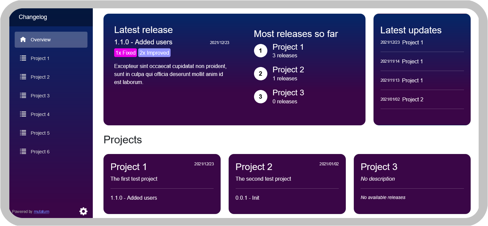

<h1 align="center">Mutatum</h1>

<h4 align="center">A damn good changelog system without any bloat.</h4>

    
    
    
    
    

  <a href="https://mutatum.dev/">Website</a> •
  <a href="#features">Features</a> •
  <a href="#demo">Demo</a> •
  <a href="https://docs.mutatum.dev/">Documentation</a> •
  <a href="#installation">Installation</a> •
  <a href="LICENSE">License</a>

## Features

🚀 Easy setup in a few minutes

💾 Supports many different databases

✏️ Supports Markdown

💌 Easily integrate it into your existing webpage

🏎️ Does <ins><u>one</u></ins> thing: changelog

🔓 No user account needed to browse changelog

🔐 Secure admin pages for editing changelog

⌨️ Easy to maintain, no exotic dependencies

## Demo

Demo server:

- **URL**: https://app-mutatum-demo.azurewebsites.net/
- **Email**: admin@example.com
- **Password**: Admin123!

Demo of popover on external page: https://stmutatumdemo.z6.web.core.windows.net/popover-example.html

## Installation

Sorry, but Mutatum is not really ready to be used yet. Once ready, you will be able to run it in a Docker container with support for many different databases. Stay tuned!

## Why the Weird Name

_Mūtātum_ is Latin, making me sound important and knowledgeable.

> **mūtātus (_neuter_ mūtātum)**: altered, changed, modified.
